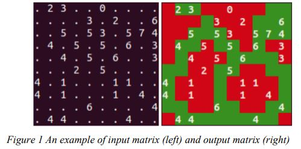

# Solving Coloring Puzzle
This is a solution for coloring puzzles

## Descriptions:
You are asked to build a coloring puzzle solver by using the first order logic to CNF 
as described below:
- Given a matrix of size m x n, where each cell will be a non-negative integer or zero 
(empty cell). Each cell is considered to be adjacent to itself and 8 surrounding cells.
- Your puzzle needs to color all the cells of the matrix with either blue or red, so that the 
number inside each cell corresponds to the number of green squares adjacent to that cell (see 
Figure 1)

## Introduction to Satisfiability Problems (SAT)
Please flick through `cnfsat.pdf` file

## Idea:
The idea comes from Minesweeper problems. Read more about the problem in `./references/lecture08` 
and `./references/lecture09`

**KN(k,n) = U(k,n) ^ L(k,n)**

KN(k,n): k out of n adjacent unknown squares are mines

U(k,n): At most k out of n squares contain a mine

L(k,n): At least k out of n squares contain a mine

**Conversion to at least**

The proposition holds True if and only if k > 0 and k + 1 <= n

U(k,n): For any k+1 squares out of n, at least one is not a mine

L(k,n): For any n-(k-1) squares out of n, at least one is mine

**With the problem:** The number of unknown squares = The number of adjacent squares

## To run this program:
1. Open a terminal
2. Run `python main.py`

## Environment:
- Python 3.9.6
- Anaconda, Windows 10

## Libraries:
- pysat
- numpy
- matplotlib

## References:
1. https://www.geeksforgeeks.org/minesweeper-solver/
2. https://github.com/pysathq/pysat
